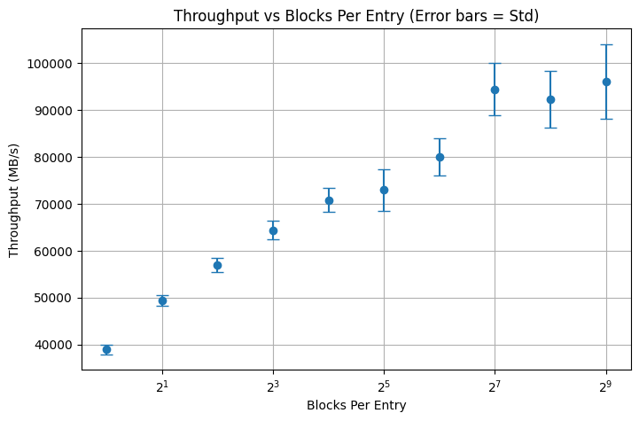

# Implementation of a two servers 3-dimensional information theoretic PIR
This project implements the 2-server, 3-dimensional Private Information Retrieval PIR protocol described in [Private Information Retrieval](https://dl.acm.org/doi/pdf/10.1145/293347.293350) by Benny Chor, Oded Golreich, Eyal Kushilevitz, and Madhu Sudan. The goal is to enable users to retrieve data privately from two servers without revealing which item is being accessed.

This protocol assumes that the two servers do not collude or share information about the queries they receive. As long as each server operates independently and does not communicate with the other, the privacy of the user's query is guaranteed. If the servers were to collude, they could potentially reconstruct the user's access pattern and compromise privacy.

To maximize performance, the implementation leverages AVX vectorized instructions and memory prefetching techniques. These optimizations help accelerate the core PIR computations and reduce memory access latency.
The PIR entries are divided into blocks, each block is 32 bytes to match with AVX vectorized instructions.

# Experiments
We conducted experiments using a 1GB database, varying the entry sizes to evaluate performance. Throughput was measured by dividing the total database size by the elapsed time for each server simulation. The results are visualized below:

To rerun or further analyze the experiments, refer to [notebooks/experiments.ipynb](notebooks/experiments.ipynb).

# PIR logic
In the original paper by Chor, Goldreich, Kushilevitz, and Sudan, a $d$-dimensional cube scheme was introduced. Using covering codes, this enables constructing a 2-server PIR with a 3-dimensional cube, achieving communication complexity of $O(n^{1/3})$.

Let $x \in \{0,1\}^n$ be a database of $n$ bits, where $n = N^3$. We embed $x$ in a 3-dimensional cube, associating each position $i \in [n]$ with a tuple $(i_1, i_2, i_3) \in [N]^3$. The scheme proceeds as follows:

## Client Queries

The client chooses uniformly and independently three random subsets $(S_1^0, S_2^0, S_3^0) \subseteq [N]$. Based on these, the client defines three more subsets:
- $S_1^1 = S_1^0 \oplus \{i_1\}$
- $S_2^1 = S_2^0 \oplus \{i_2\}$
- $S_3^1 = S_3^0 \oplus \{i_3\}$

For every $\sigma_1, \sigma_2, \sigma_3 \in \{0,1\}$, define $q_{\sigma_1,\sigma_2,\sigma_3} = (S_1^{\sigma_1}, S_2^{\sigma_2}, S_3^{\sigma_3})$.

- The client sends $q_{000}$ to server 1.
- The client sends $q_{111}$ to server 2.

## Server Answers

Upon receiving a query $(S_1, S_2, S_3)$, the server computes:

1. **Base Subcube XOR:**  
    Calculate the XOR of bits in the subcube defined by $(S_1, S_2, S_3)$:
    $$A_{S_1 S_2 S_3} = \bigoplus_{(j_1, j_2, j_3) \in S_1 \times S_2 \times S_3} x_{j_1, j_2, j_3}$$

2. **Subcubes with Hamming-1 Neighbors:**  
    For each coordinate $t \in \{1,2,3\}$ and every $j \in [N]$, compute:
    $$A_{S_1 S_2 S_3, t, j} = \bigoplus_{\substack{j_i \in S_i \ \forall i \neq t \\ j_t \in S_t \oplus \{j\}}} x_{j_1, j_2, j_3}$$

Overall, $3N + 1 = 3n^{1/3} + 1$ bits are returned.

## Client Logic

The client extracts answers corresponding to $q_{000}, q_{100}, q_{010}, q_{001}$ from server 1 and $q_{111}, q_{011}, q_{101}, q_{110}$ from server 2, then XORs all the answers. The position $(i_1, i_2, i_3)$ is the only one contained in an odd number of subcubes, ensuring correctness.

For index $(i_1, i_2, i_3)$, the relevant values are:

1. $q_{000} \mapsto A_{S^0_1 S^0_2 S^0_3}$
2. $q_{100} \mapsto A_{S^0_1 S^0_2 S^0_3, 1, i_1}$
3. $q_{010} \mapsto A_{S^0_1 S^0_2 S^0_3, 2, i_2}$
4. $q_{001} \mapsto A_{S^0_1 S^0_2 S^0_3, 3, i_3}$
5. $q_{111} \mapsto A_{S^1_1 S^1_2 S^1_3}$
6. $q_{011} \mapsto A_{S^1_1 S^1_2 S^1_3, 1, i_1}$
7. $q_{101} \mapsto A_{S^1_1 S^1_2 S^1_3, 2, i_2}$
8. $q_{110} \mapsto A_{S^1_1 S^1_2 S^1_3, 3, i_3}$
